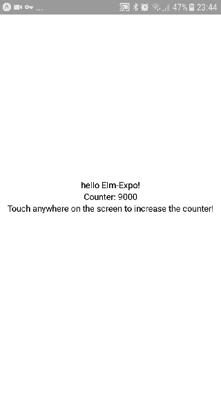

# Elm \<-> Expo bridge (proof of concept)

Elm-Expo is an example Elm app for mobile phones, built with [React Native](https://facebook.github.io/react-native/) and [Expo](https://expo.io). Elm-Expo is currently at a proof-of-concept stage, and only tested on Android.



Under the hood, the app is built in a similar way as the [elm-ios](https://github.com/pzp1997/elm-ios) proof of concept project. But instead of using a custom-built helper app on the mobile phone, Elm-Expo reuses the already existing Expo app for this purpose.

## Architecture

Starting from the Elm side, the app has the following main parts:

- **src/Main.elm** &mdash; the main logic of the app (`view`, `update`, etc.)
- **elm-expo/src/Expo.elm** &mdash; an Elm package defining `Expo.program`, as well as various helper functions and types for building an Expo app (views, attributes, etc.)
  - Note: this package is technically just a wrapper over VirtualDom package; but it is specifically tailored for this use case.
- **elm-rn-bridge.js** &mdash; a JS module containing the main magic sauce of this project. Specifically, it:
  - hijacks React Native's "[MessageQueue](https://github.com/facebook/react-native/blob/v0.55.4/Libraries/BatchedBridge/MessageQueue.js)" (a.k.a. "[BatchedBridge](https://github.com/facebook/react-native/blob/v0.55.4/Libraries/BatchedBridge/BatchedBridge.js)") &mdash; the JSON-based bus used by React Native to communicate between JavaScript and native Java (Android) / Swift (iOS) code;
  - creates a fake DOM API for Elm, injecting a fake `document` to Elm, and translating DOM method calls emitted by Elm, such as `createElement`, to ReactNative calls, such as `createView`.
  - hijacks events emitted from native (Java/Swift) world back to JavaScript, then translates them to DOM-like events, and sends to Elm instead of RN (currently only implemented for global touch events).
- **App.js** &mdash; main entry point, where all the above components are glued together;
- **Expo / create-react-native-app** &mdash; the base platform on which the Elm & JS code is executed on a mobile phone.

## Example transcript of MessageQueue communication

A `N->JS` prefix means "Native to JavaScript", `JS->N` means reverse direction. The `CLICKS` messages are emitted by Elm's `Debug.log`. Lines starting with `...` are additional custom debugging messages.


```
23:44:38: Finished building JavaScript bundle in 63ms
23:44:41: N->JS : RCTDeviceEventEmitter.emit("appStateDidChange",{"app_state":"background"})
23:44:42: ...bridgeEvents init
23:44:42: ...app.js end...
23:44:42: JS->N : ExponentKeepAwake.activate()
23:44:42: JS->N : BlobModule.createFromParts([],"0b7d9bef-68f5-4f71-9585-9bb016377687")
23:44:42: N->JS : AppRegistry.runApplication("main",{"initialProps":{"exp":{"lastErrors":[{"isFatal":true,"errorMessage":"Packager is not running at http://172.25.161.111:19001","exceptionId":-1330971222},{"isFatal":true,"errorMessage":"Packager is not running at http://172.25.161.111:19001","exceptionId":-1531252073},{"isFatal":true,"errorMessage":"Packager is not running at http://172.25.161.111:19001","exceptionId":-1005600663},{"isFatal":true,"errorMessage":"Packager is not running at http://172.25.161.111:19001","exceptionId":-174264584}],"initialUri":"exp://172.25.161.111:19000","manifest":{"isVerified":true,"version":"0.1.0","slug":"elm-native-expo-counter","name":"elm-native-expo-counter","xde":true,"sdkVersion":"27.0.0","id":"@anonymous/elm-native-expo-counter-56c2036c-4e81-4112-9beb-ade6e2499eaa","mainModuleName":"./node_modules/react-native-scripts/build/bin/crna-entry","packagerOpts":{"dev":true,"lanType":"ip","hostType":"tunnel","minify":false},"bundleUrl":"http://172.25.161.111:19001/./node_modules/react-native-scripts/build/bin/crna-entry.bundle?platform=android&dev=true&minify=false&hot=false&assetPlugin=C%3A%5Cprog%5Celm-native-expo-counter%5Cnode_modules%5Cexpo%5Ctools%5ChashAssetFiles","orientation":"default","primaryColor":"#023C69","logUrl":"http://172.25.161.111:19000/logs","loadedFromCache":false,"env":{"REACT_NATIVE_PACKAGER_HOSTNAME":"172.25.161.111"},"debuggerHost":"172.25.161.111:19001","iconUrl":"https://d3lwq5rlu14cro.cloudfront.net/ExponentEmptyManifest_192.png","developer":{"tool":"crna","projectRoot":"C:\\prog\\elm-native-expo-counter"}},"shell":false}},"rootTag":691})
23:44:42: Running app on SM-A320FL in development mode

23:44:42: N->JS : RCTDeviceEventEmitter.emit("appStateDidChange",{"app_state":"active"})
23:44:42: N->JS : RCTDeviceEventEmitter.emit("networkStatusDidChange",{"effectiveConnectionType":"unknown","connectionType":"wifi","network_info":"WIFI"})
23:44:42: N->JS : <callback for AppState.getCurrentAppState>({"app_state":"active"})
23:44:42: JS->N : UIManager.createView(-2147483649,"RCTView",691,{"flex":1,"alignItems":"center","justifyContent":"center"})
23:44:42: JS->N : UIManager.createView(-2147483647,"RCTText",691,{})
23:44:42: JS->N : UIManager.createView(-2147483645,"RCTRawText",691,{"text":"hello Elm-Expo!"})
23:44:42: JS->N : UIManager.setChildren(-2147483647,[-2147483645])
23:44:42: JS->N : UIManager.createView(-2147483643,"RCTText",691,{})
23:44:42: JS->N : UIManager.createView(-2147483641,"RCTRawText",691,{"text":"Counter: 9000"})
23:44:42: JS->N : UIManager.setChildren(-2147483643,[-2147483641])
23:44:42: JS->N : UIManager.createView(-2147483639,"RCTText",691,{})
23:44:42: JS->N : UIManager.createView(-2147483637,"RCTRawText",691,{"text":"Touch anywhere on the screen to increase the counter!"})
23:44:42: JS->N : UIManager.setChildren(-2147483639,[-2147483637])
23:44:42: JS->N : UIManager.setChildren(-2147483649,[-2147483647,-2147483643,-2147483639])
23:44:42: JS->N : UIManager.manageChildren(691,[],[],[-2147483649],[0],[])
23:44:42: ...addEventListener: added handler! mousedown=function performTask(event) {
23:44:42:                                                       var result = A2(_elm_lang$core$Json_Decode$decodeValue, decoder, event);
23:44:42:
23:44:42:                                                       if (result.ctor === 'Ok') {
23:44:42:                                                               _elm_lang$core$Native_Scheduler.rawSpawn(toTask(result._0));
23:44:42:                                                       }
23:44:42:                                               }
23:44:54: N->JS : RCTEventEmitter.receiveTouches("topTouchStart",[{"identifier":0,"locationY":408.5,"locationX":203,"pageY":408.5,"timestamp":1239488497,"target":691,"pageX":203}],[0])
23:44:54: ...receiveTouches: args={"0":"topTouchStart","1":[{"identifier":0,"locationY":408.5,"locationX":203,"pageY":408.5,"timestamp":1239488497,"target":691,"pageX":203}],"2":[0]}
23:44:54: N->JS : RCTEventEmitter.receiveTouches("topTouchStart",[{"identifier":0,"locationY":408.5,"locationX":203,"pageY":408.5,"timestamp":1239488497,"target":691,"pageX":203}],[0])
23:44:54: ...receiveTouches: args={"0":"topTouchStart","1":[{"identifier":0,"locationY":408.5,"locationX":203,"pageY":408.5,"timestamp":1239488497,"target":691,"pageX":203}],"2":[0]}
23:44:54: CLICKS:: 9001
23:44:54: CLICKS:: 9002
23:44:54: JS->N : UIManager.updateView(-2147483641,"RCTRawText",{"text":"Counter: 9002"})
23:44:54: N->JS : RCTEventEmitter.receiveTouches("topTouchEnd",[{"identifier":0,"locationY":408.5,"locationX":203,"pageY":408.5,"timestamp":1239488595,"target":691,"pageX":203}],[0])
23:44:54: ...receiveTouches: args={"0":"topTouchEnd","1":[{"identifier":0,"locationY":408.5,"locationX":203,"pageY":408.5,"timestamp":1239488595,"target":691,"pageX":203}],"2":[0]}
23:44:55: N->JS : RCTEventEmitter.receiveTouches("topTouchStart",[{"identifier":0,"locationY":371.5,"locationX":239,"pageY":371.5,"timestamp":1239489062,"target":691,"pageX":239}],[0])
23:44:55: ...receiveTouches: args={"0":"topTouchStart","1":[{"identifier":0,"locationY":371.5,"locationX":239,"pageY":371.5,"timestamp":1239489062,"target":691,"pageX":239}],"2":[0]}
23:44:55: N->JS : RCTEventEmitter.receiveTouches("topTouchStart",[{"identifier":0,"locationY":371.5,"locationX":239,"pageY":371.5,"timestamp":1239489062,"target":691,"pageX":239}],[0])
23:44:55: ...receiveTouches: args={"0":"topTouchStart","1":[{"identifier":0,"locationY":371.5,"locationX":239,"pageY":371.5,"timestamp":1239489062,"target":691,"pageX":239}],"2":[0]}
23:44:55: CLICKS:: 9003
23:44:55: CLICKS:: 9004
23:44:55: JS->N : UIManager.updateView(-2147483641,"RCTRawText",{"text":"Counter: 9004"})
23:44:55: N->JS : RCTEventEmitter.receiveTouches("topTouchEnd",[{"identifier":0,"locationY":371.5,"locationX":239,"pageY":371.5,"timestamp":1239489143,"target":691,"pageX":239}],[0])
23:44:55: ...receiveTouches: args={"0":"topTouchEnd","1":[{"identifier":0,"locationY":371.5,"locationX":239,"pageY":371.5,"timestamp":1239489143,"target":691,"pageX":239}],"2":[0]}
23:44:55: N->JS : RCTEventEmitter.receiveTouches("topTouchStart",[{"identifier":0,"locationY":302.5,"locationX":276,"pageY":302.5,"timestamp":1239489495,"target":691,"pageX":276}],[0])
23:44:55: ...receiveTouches: args={"0":"topTouchStart","1":[{"identifier":0,"locationY":302.5,"locationX":276,"pageY":302.5,"timestamp":1239489495,"target":691,"pageX":276}],"2":[0]}
23:44:55: N->JS : RCTEventEmitter.receiveTouches("topTouchStart",[{"identifier":0,"locationY":302.5,"locationX":276,"pageY":302.5,"timestamp":1239489495,"target":691,"pageX":276}],[0])
23:44:55: ...receiveTouches: args={"0":"topTouchStart","1":[{"identifier":0,"locationY":302.5,"locationX":276,"pageY":302.5,"timestamp":1239489495,"target":691,"pageX":276}],"2":[0]}
23:44:55: CLICKS:: 9005
23:44:55: CLICKS:: 9006
23:44:55: JS->N : UIManager.updateView(-2147483641,"RCTRawText",{"text":"Counter: 9006"})
23:44:55: N->JS : RCTEventEmitter.receiveTouches("topTouchMove",[{"identifier":0,"locationY":302.5,"locationX":275.5,"pageY":302.5,"timestamp":1239489577,"target":691,"pageX":275.5}],[0])
23:44:55: ...receiveTouches: args={"0":"topTouchMove","1":[{"identifier":0,"locationY":302.5,"locationX":275.5,"pageY":302.5,"timestamp":1239489577,"target":691,"pageX":275.5}],"2":[0]}
23:44:55: N->JS : RCTEventEmitter.receiveTouches("topTouchEnd",[{"identifier":0,"locationY":302.5,"locationX":275.5,"pageY":302.5,"timestamp":1239489584,"target":691,"pageX":275.5}],[0])
23:44:55: ...receiveTouches: args={"0":"topTouchEnd","1":[{"identifier":0,"locationY":302.5,"locationX":275.5,"pageY":302.5,"timestamp":1239489584,"target":691,"pageX":275.5}],"2":[0]}
```
